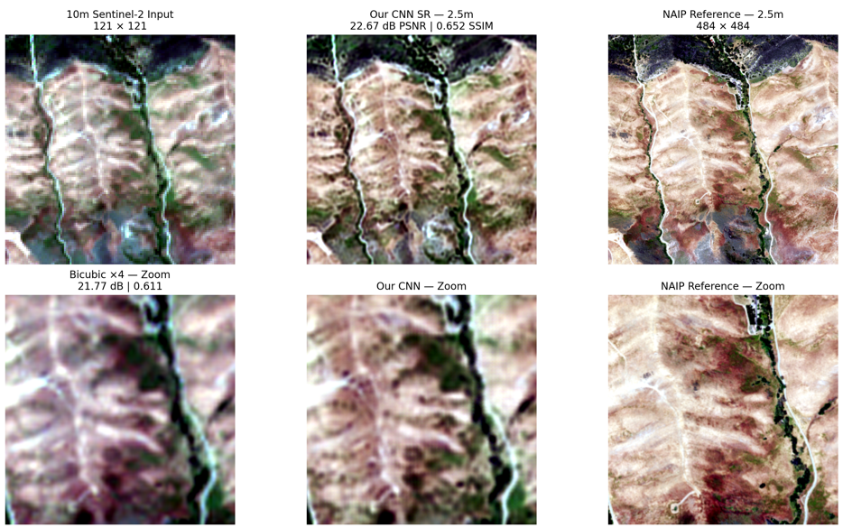
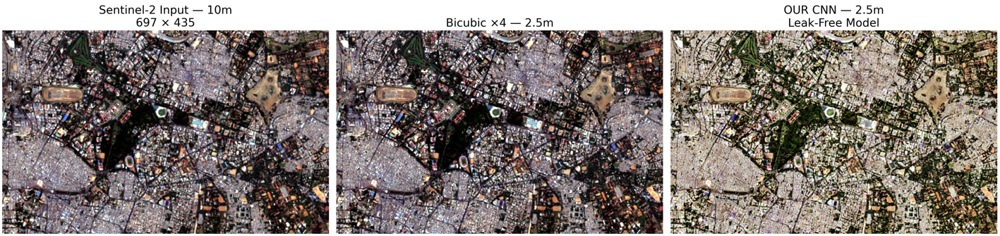
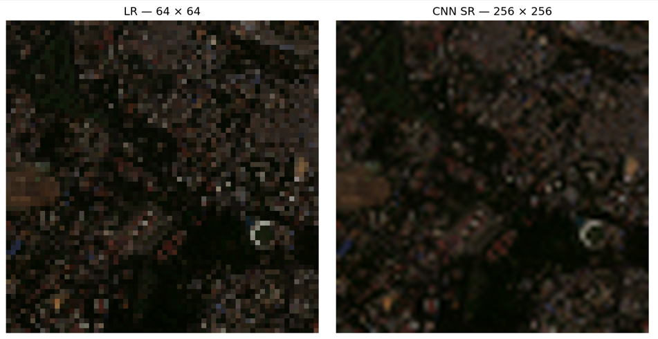

# Deep Learning Based Super-Resolution Mapping for Satellite Imagery

<p align="center">
  <b>Sentinel-2 10 m → Estimated 2.5 m Super-Resolution</b>
</p>

<p align="center">
  
  
  
  
  
</p>

---

## Overview

**Deep Learning Based Super-Resolution Mapping (SRM)** is a satellite-image super-resolution system designed to estimate finer spatial representations from medium-resolution Sentinel-2 imagery.

The system takes approximately **10 m Sentinel-2 imagery** and produces a **4× upsampled representation corresponding to an estimated 2.5 m spatial grid**.

The project combines:

- Residual convolutional super-resolution
- PixelShuffle-based upsampling
- ICNR initialization for improved sub-pixel stability
- Spectral harmonization for cross-sensor validation
- Synthetic degradation experiments
- Paired Sentinel-2 / NAIP validation
- Leakage-free scene-level evaluation
- PSNR and SSIM based quality assessment

> **Important:** The 2.5 m output is an estimated high-resolution reconstruction. It should not be interpreted as directly measured 2.5 m Sentinel-2 imagery.

---

## Why Super-Resolution Mapping?

Sentinel-2 provides wide-area multispectral coverage at relatively high revisit frequency, but its spatial resolution limits some fine-scale mapping applications.

Super-resolution aims to estimate spatial structures that are not directly resolved in the input image. Instead of simply enlarging pixels using interpolation, our model learns a mapping:

```text
        Sentinel-2
          ~10 m
            │
            ▼
     Residual SR CNN
            │
            ▼
     Estimated 2.5 m
```

The goal is not merely to make imagery look sharper, but to produce a reconstruction that is:

- Spatially coherent
- Spectrally consistent
- Quantitatively validated
- Resistant to train/test leakage

---

## System Architecture

```text
                 Sentinel-2 Image
                      ~10 m
                        │
                        ▼
              Preprocessing / QA
                        │
              ┌─────────┴─────────┐
              │                   │
              ▼                   ▼
       Synthetic SR Track   Real S2–NAIP Track
              │                   │
              ▼                   ▼
        Controlled 4×       Spectral Harmonization
          degradation              │
              │                   │
              └─────────┬─────────┘
                        ▼
                 Residual CNN
                        │
                Residual Blocks
                        │
                  Feature Trunk
                        │
               PixelShuffle ×2
                        │
               PixelShuffle ×2
                        │
                        ▼
              Estimated 2.5 m SR
                        │
                        ▼
              Quantitative Evaluation
```

---

## Model

The main super-resolution network is a residual CNN with sub-pixel upsampling.

### Architecture

```text
Input
3 / 4 channels
      │
      ▼
3×3 Feature Extraction
      │
      ▼
Residual Feature Trunk
      │
      ├── Residual Block
      ├── Residual Block
      ├── ...
      └── Residual Block
      │
      ▼
Middle Convolution
      │
      ▼
PixelShuffle ×2
      │
      ▼
PixelShuffle ×2
      │
      ▼
Output Reconstruction
```

The Bengaluru synthetic demonstration uses a 3-channel RGB model, while the real Sentinel-2 / NAIP pipeline uses the corresponding multispectral configuration.

### Why Residual Learning?

The network does not have to reconstruct the entire high-resolution image from scratch. Instead, it uses an interpolated image as a baseline and learns a correction:

```text
SR = Bicubic Upsampling + Learned Residual
```

This encourages the model to focus on missing spatial detail while preserving the broad structure of the original observation.

### PixelShuffle + ICNR

The 4× upsampling stage is implemented using two 2× PixelShuffle operations.

To reduce sub-pixel initialization artifacts, the convolution preceding each PixelShuffle operation uses ICNR initialization. This is intended to provide a smoother starting point for sub-pixel reconstruction and reduce checkerboard-like artifacts during early optimization.

---

## Training Strategy

### Synthetic Super-Resolution

For controlled experiments, high-resolution satellite patches are synthetically degraded:

```text
HR reference
     │
     ▼
mild degradation
     │
     ├── optional blur
     ├── 4× bicubic downsampling
     └── low-amplitude noise
     │
     ▼
64 × 64 LR
     │
     ▼
CNN
     │
     ▼
256 × 256 SR
```

This allows the network to be evaluated against a known HR reference.

### Data Augmentation

Training uses spatial augmentation including:

- Horizontal flips
- Vertical flips
- 90° rotations

Degradation parameters can also vary during training so the network does not repeatedly see exactly the same low-resolution observation.

### Loss Function

The training objective combines several complementary terms:

```text
L = 0.65 L1
  + 0.20 L_SSIM
  + 0.05 L_gradient
  + 0.10 L_color
```

| Term | Purpose |
|---|---|
| **L1 Reconstruction Loss** | Encourages pixel-level agreement with the HR target. |
| **SSIM Loss** | Encourages structural similarity. |
| **Gradient Loss** | Encourages preservation of edges and high-frequency spatial structure. |
| **Color Consistency Loss** | Penalizes shifts in channel statistics and helps prevent unwanted color drift. |

---

## Real-Data Validation

Synthetic experiments alone are not sufficient to demonstrate real-world performance.

For real-data evaluation, the project uses paired:

```text
Sentinel-2  →  ~10 m
NAIP        →  ~2.5 m reference imagery
```

This provides an independent high-resolution reference for evaluating whether the super-resolved output is closer to real high-resolution imagery than a simple interpolation baseline.

### Leakage-Free Evaluation

A major focus of the project is avoiding overly optimistic evaluation caused by spatial or acquisition overlap between training and testing data.

The dataset was audited for overlap across:

- Sentinel-2 acquisition IDs
- NAIP IDs
- ROI identifiers
- Acquisition geometry

A connected-component based split was then used to construct a leakage-free train/validation/test partition.

The final clean split contains:

| Split | ROIs | Components |
|---|---|---|
| Train | 2281 | 827 |
| Validation | 286 | 104 |
| Test | 284 | 99 |

All audited cross-split conflicts were removed in the final evaluation split.

### Spectral Harmonization

Because Sentinel-2 and NAIP are different sensors, their raw pixel distributions are not directly interchangeable.

A training-only spectral mapping was therefore fitted before evaluation. The mapping was estimated exclusively from the clean training split and then applied to validation/test data. This reduces sensor-distribution mismatch when comparing super-resolved Sentinel-2 outputs against high-resolution NAIP reference imagery.

---

## Results

### Leakage-Free Real-Data Test Set

**Harmonized Bicubic Baseline**
- PSNR: 21.4462 ± 2.8829 dB
- SSIM: 0.5991 ± 0.1742

**Clean Harmonized CNN**
- PSNR: 22.3115 ± 2.8146 dB
- SSIM: 0.6339 ± 0.1606

**Improvement**
- PSNR: +0.8652 dB
- SSIM: +0.0348

The CNN improved PSNR on **216 / 284 test ROIs (≈76.1%)** and improved SSIM on **262 / 284 test ROIs (≈92.3%)**.

These numbers come from the leakage-free held-out real-data evaluation.

<p align="center">
  
  <br />
  <sub>Top: full comparison (10 m Sentinel-2 input → CNN SR output → NAIP reference). Bottom: zoomed detail against a bicubic ×4 baseline.</sub>
</p>

### Synthetic Held-Out Experiment

A controlled synthetic experiment was also performed on a held-out Rajasthan scene.

| Method | PSNR | SSIM |
|---|---|---|
| Bicubic ×4 | 36.63 dB | 0.8760 |
| Residual PixelShuffle CNN | 36.89 dB | 0.8849 |

**Improvement:** PSNR +0.26 dB, SSIM +0.0089

This experiment demonstrates that the learned model can improve upon interpolation under the controlled synthetic degradation.

---

## Visual Demonstration

A full-scene Bengaluru demonstration illustrates the intended application:

```text
Sentinel-2 ~10 m
        │
        ▼
   SR CNN / 4×
        │
        ▼
Estimated ~2.5 m
```

The output should be interpreted as a model-estimated high-resolution reconstruction, not as direct 2.5 m ground-truth imagery.

<p align="center">
  
  <br />
  <sub>Full-scene Bengaluru demonstration — Sentinel-2 input (10 m), bicubic ×4 baseline (2.5 m), and leak-free CNN output (2.5 m).</sub>
</p>

### Example: Controlled Synthetic Experiment

```text
64 × 64 LR
      │
      ▼
Residual PixelShuffle CNN
      │
      ▼
256 × 256 SR
      │
      ▼
256 × 256 HR Reference
```

<p align="center">
  
  <br />
  <sub>Zoomed detail: 64 × 64 synthetic LR input vs. 256 × 256 CNN SR output.</sub>
</p>

The repository contains example visualizations showing the input, model output, interpolation baseline, and HR reference.

---

## Project Structure

```text
sih-srm/
│
├── checkpoints/
│
├── data/
│   └── processed/
│       ├── Processed images/
│       ├── train/
│       ├── val/
│       ├── test/
│       ├── real/
│       ├── real_clean/
│       └── bengaluru_demo/
│
├── models/
│   └── sr_cnn.py
│
├── scripts/
│   ├── prepare_synthetic_data.py
│   ├── train_bengaluru_demo.py
│   ├── visualize_bengaluru_synthetic.py
│   │
│   ├── download_sen2naip.py
│   ├── prepare_leak_free_real.py
│   ├── fit_clean_spectral_mapping.py
│   ├── baseline_clean_real.py
│   ├── train_real_harmonized.py
│   ├── evaluate_clean_real.py
│   ├── visualize_clean_64_256.py
│   └── visualize_clean_simple.py
│
├── docs/
│   └── assets/
│       ├── sentinel2_naip_validation.png
│       ├── bengaluru_full_scene_comparison.png
│       └── synthetic_lr_sr_example.png
│
└── README.md
```

> **Note:** Avoid committing raw `data/`, `.pth` checkpoint, or `.npy` files to the repository — keep the repo limited to code, docs, and small reference figures like the ones in `docs/assets/`.

---

## Installation

### 1. Clone the repository

```bash
git clone https://github.com/YOUR_USERNAME/sih-srm.git
cd sih-srm
```

### 2. Create a virtual environment

**Windows**
```bash
python -m venv .venv
.venv\Scripts\activate
```

**Linux / macOS**
```bash
python3 -m venv .venv
source .venv/bin/activate
```

### 3. Install dependencies

```bash
pip install -r requirements.txt
```

### Hardware

The development and training workflow was optimized for:

- **GPU:** NVIDIA RTX 3060 12 GB
- **CUDA:** 12.8
- **PyTorch:** 2.11.0

Mixed-precision training is enabled when CUDA is available.

---

## Running the Bengaluru Demo

Prepare the synthetic dataset:

```bash
python scripts/prepare_synthetic_data.py
```

Train the Bengaluru 3-channel demo:

```bash
python scripts/train_bengaluru_demo.py
```

The model produces:

```text
64 × 64 LR  →  CNN  →  256 × 256 SR
```

The generated comparison is stored under:

```text
data/processed/bengaluru_demo/
```

---

## Real-Data Pipeline

The real-data experiment follows the sequence:

```text
Download paired S2–NAIP data
          │
          ▼
Prepare ROI dataset
          │
          ▼
Audit overlap
          │
          ▼
Build leakage-free split
          │
          ▼
Fit training-only spectral mapping
          │
          ▼
Train harmonized SR model
          │
          ▼
Evaluate on held-out test ROIs
          │
          ▼
Compare against bicubic
```

The final real-data benchmark should be reproduced using the clean split rather than the earlier contaminated split.

---

## Important Scientific Limitation

Single-image super-resolution is an inverse problem. A 10 m observation does not uniquely determine every detail that would exist at 2.5 m. Therefore, the model's output represents an **estimated reconstruction**.

In particular:

- Sharpening does not prove that every fine detail is physically observed.
- Visually plausible structures may still be model-inferred.
- The output should not be treated as direct ground truth.
- Independent high-resolution reference data is important for validation.

For this reason, the project emphasizes both **observation-based quantitative validation** and **uncertainty and hallucination awareness**, rather than visual sharpness alone.

---

## What This Project Demonstrates

The project demonstrates that a learned residual super-resolution model can improve upon interpolation under:

- Controlled synthetic degradation
- Real paired high-resolution reference evaluation
- Leakage-free train/test separation

The strongest real-data evidence is the improvement over the harmonized bicubic baseline on the held-out SEN2NAIP test set.

---

## Roadmap

Future improvements include:

- Larger multi-scene training datasets
- More realistic sensor/degradation modeling
- Uncertainty estimation
- Multi-scale supervision
- Perceptual feature losses
- Stronger transformer or hybrid architectures
- Multi-temporal fusion
- Additional geographic regions
- Full-scene geospatial inference pipelines

---

## Reproducibility

The project separates **synthetic experiment** from **real-data validation** to avoid mixing controlled benchmark results with cross-sensor real-world evaluation.

All reported real-data metrics use the leakage-free test split and training-only spectral harmonization.

---

## Disclaimer

This project generates estimated super-resolved representations of satellite imagery. A 4× spatial grid does not mean that the model has measured new physical information at true 2.5 m resolution.

The system should therefore be used as a reconstruction and mapping aid, with appropriate validation for any downstream scientific or operational application.
